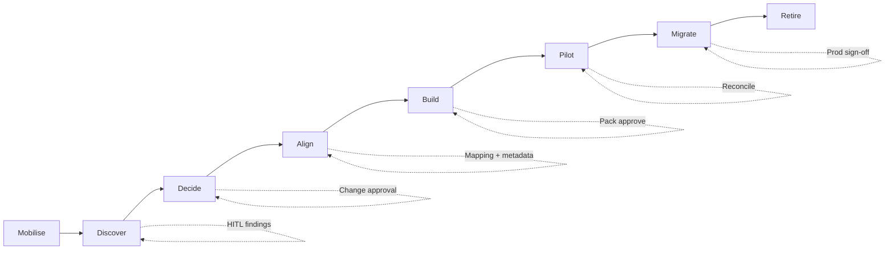

# Mirage — architecture

This document describes the logical and technical architecture of **Mirage Suite**: how legacy estates become governed cloud data products under human approval.

---

## 1. System context

```text
┌──────────────────────────────────────────────────────────────────────────┐
│                         Enterprise stakeholders                          │
│   Engineer · Architect · Data Owner · Steward · Product Owner · CB       │
└────────────────────────────────┬─────────────────────────────────────────┘
                                 │
                    ┌────────────▼────────────┐
                    │     Mirage Suite        │
                    │  UI · API · Agents · DB │
                    └─┬──────────┬──────────┬─┘
          ┌───────────┘          │          └───────────┐
          ▼                      ▼                      ▼
┌─────────────────┐   ┌──────────────────┐   ┌─────────────────────┐
│ Legacy estate   │   │ Migration repo   │   │ Target platform     │
│ SQL · scripts   │   │ discover/decide/ │   │ Landing · Warehouse │
│ DAGs · catalog  │   │ align/build/…    │   │ Spark · Orchestration│
│ usage evidence  │   │ versioned JSON   │   │ Catalogue · Hub     │
└─────────────────┘   └──────────────────┘   └─────────────────────┘
```

Mirage is the **control plane**: it discovers evidence, records decisions, generates reviewable artifacts, and gates progression. Domain **data planes** (warehouse, Spark, Airflow) execute workloads outside Mirage.

---

## 2. Control-plane layers

| Layer | Responsibility | Implementation (MVP) |
| --- | --- | --- |
| **Experience** | Suite Dashboard, Gallery, named tool workspaces | Next.js 14 · Mirage brand |
| **API / orchestration** | Auth, projects, portfolio KPIs, tool/phase APIs, agents | FastAPI · workers |
| **Intelligence** | Assessment, mapping, product ID, code drafts | Agents (mock / LLM) with structured outputs |
| **Persistence** | Inventory, dispositions, mappings, products, artifacts, audit | Relational DB + JSON columns |
| **Artifact store** | Durable stage exports for audit and reuse | `migration-repo/` tree per project |
| **Adapters** | Estate bind (sample / ZIP / Git), Hub probe | Backend adapters |

```text
┌─────────────────────────────────────────────────────────────┐
│ Experience (Next.js)                                        │
│  Dashboard · Gallery · Suite tools · HITL · Role chrome     │
└────────────────────────────┬────────────────────────────────┘
                             │ HTTPS / JWT
┌────────────────────────────▼────────────────────────────────┐
│ API & workers (FastAPI)                                     │
│  Projects · Discovery · Disposition · Align · Build         │
│  Pilot · Migrate · Retire · Agents · Audit                  │
└───────┬───────────────────┬───────────────────┬─────────────┘
        │                   │                   │
        ▼                   ▼                   ▼
┌───────────────┐  ┌────────────────┐  ┌────────────────────┐
│ Application   │  │ Agent runtime  │  │ Artifact export    │
│ database      │  │ (task runners) │  │ migration-repo/**  │
└───────────────┘  └────────────────┘  └────────────────────┘
```

---

## 3. Journey architecture (gates)

Each phase writes evidence, then a **role-gated exit** unlocks the next stage.



| Gate | Evidence | Authority (typical) |
| --- | --- | --- |
| Discovery sign-off | Inventory + lineage + HITL complete | Architect / engineer |
| Disposition approve | Register + benefits | Change board / product owner |
| Align complete | SID pack + ownership / classification | Architect / data owner |
| Build approve | Conversion artifacts | Architect / engineer |
| Pilot reconcile | Dual-run within tolerance | Product owner / engineer |
| Production sign-off | Promote + consumers + freeze | Change board / architect |
| Decommission close | Archive + hypercare | Data owner |

---

## 4. Data flow — Discover to Build

```text
Legacy root
   │
   ├─► Parsers (SQL / scripts / DAG dirs / catalog / usage)
   │         │
   │         ▼
   │   InventoryObject · LineageEdge · JobNode
   │         │
   │         ▼
   │   Assessment findings ──HITL──► ReviewItem (accepted / flagged)
   │         │
   ▼         ▼
Disposition scoring ──► Disposition register (migrate|rebuild|consolidate|archive|retire)
         │
         ▼
   SID / metadata alignment ──► MappingRow + entity metadata
         │
         ▼
   Build pack generator ──► BuildArtifact (table | code | dag)
         │
         ▼
   migration-repo/build/{tables,code,dags}/
```

**Disposition-first rule:** only `migrate` / `rebuild` survivors enter the conversion pack. Orchestration inventory (DAGs) is included in Decide so Build can emit scheduler artifacts.

---

## 5. Target platform shape (illustrative)

Mirage is platform-shaped, not vendor-locked. The MVP conversion lanes map as follows:

| Asset class | Source examples | Target examples |
| --- | --- | --- |
| Tables / views | Oracle, Teradata, Postgres | BigQuery (or equivalent warehouse) |
| Code / jobs | Spark, PySpark, shell, PL/SQL | Dataproc / managed Spark |
| Orchestration | Airflow DAGs | Cloud Composer / MWAA / Airflow on K8s |

```text
                    ┌──────── Hub / governance ────────┐
                    │ IAM · catalogue · perimeter      │
                    └───────────────┬──────────────────┘
                                    │
         ┌──────────────────────────┼──────────────────────────┐
         ▼                          ▼                          ▼
   Landing (GCS)              Warehouse                   Orchestration
   immutable capture          product tables              managed Airflow
         │                          │                          │
         └──────────────► Compute (Spark) ◄────────────────────┘
```

In hub-and-spoke operating models, the hub governs; domain spokes own products and expose contracted ports to consumers / marketplace.

---

## 6. Application architecture (MVP components)

```text
frontend/
  app/                     Next.js routes (login, workspace)
  components/workspace/    Phase shell, providers
  components/phases/       Discover · Decide · Align · Build · Pilot · Migrate · Retire
  lib/                     API client, phases, HITL helpers

backend/
  app/main.py              HTTP API
  app/services/
    discovery*.py          Estate scan & inventory
    disposition.py         Scoring & register
    build_pack.py          Conversion artifacts
    migrate_cutover.py     Promote · consumers · freeze · sign-off
    project_workspace.py   migration-repo export
  app/agents.py            Task runners (assessment, mapping, …)
  adapters/                Estate / hub adapters
```

### Key API surfaces

| Area | Examples |
| --- | --- |
| Auth | `/auth/login`, role-scoped JWT |
| Estate | bind sample / ZIP / Git |
| Discovery | `/discovery/run`, inventory, lineage, HITL |
| Decide | disposition analyze, overrides, approve |
| Align | SID mapping, metadata completeness |
| Build | `/build/generate`, artifacts, summary |
| Pilot | products, pipeline, reconcile |
| Migrate | promote-prod, consumers, freeze, signoff |
| Retire | retirement advance, hypercare, audit |

---

## 7. Security and accountability

| Concern | Approach |
| --- | --- |
| Authentication | JWT sessions; demo and enterprise IdP-ready pattern |
| Authorisation | Role gates on mutating endpoints |
| PII | Classification tags; viewer masking in product views |
| Secrets | Not accepted in agent prompts; estate tokens handled at bind |
| Audit | API audit events + exported stage manifests |
| Change control | Production sign-off required before Retire unlocks as complete |

---

## 8. Deployment topology

| Mode | Topology |
| --- | --- |
| Local MVP | Next.js `:3000` · FastAPI `:8000` · SQLite · sample estates on disk |
| Compose | Containerised API + UI (+ optional Postgres) |
| Enterprise | UI/API behind gateway; managed DB; object storage for migration-repo; private LLM endpoint optional |

```text
[Browser] ──► [Mirage UI] ──► [Mirage API]
                                  │
                    ┌─────────────┼─────────────┐
                    ▼             ▼             ▼
                 Database   Object/Git repo   LLM (optional)
```

---

## 9. Integration points

| Integration | Direction | Purpose |
| --- | --- | --- |
| Legacy Git / ZIP | In | Estate source for discovery |
| Platform Hub probe | Out | Validate landing / spoke readiness (mobilisation) |
| Target cloud APIs | Out (future) | Optional publish of approved packs |
| Marketplace / ODPS | Out (adjacent) | Product contracts prepared for publication tooling |
| Brownfield packaging skills | Adjacent | Spec drafting for existing repos without full estate cutover |

---

## 10. Quality attributes

| Attribute | How Mirage addresses it |
| --- | --- |
| Traceability | Stage exports + audit + agent run history |
| Controllability | Explicit gates; no silent promote |
| Scalability of method | Per-project waves; NatCo-repeatable playbooks |
| Recoverability | Dual-run before cutover; freeze window |
| Extensibility | Lane targets and reference-model packs are swappable |

---

## Related figures from the workspace


*Conversion lane architecture in the UI — source tech detected, target selected, artifacts generated.*


*Migrate readiness as an architectural control, not a checklist afterthought.*
