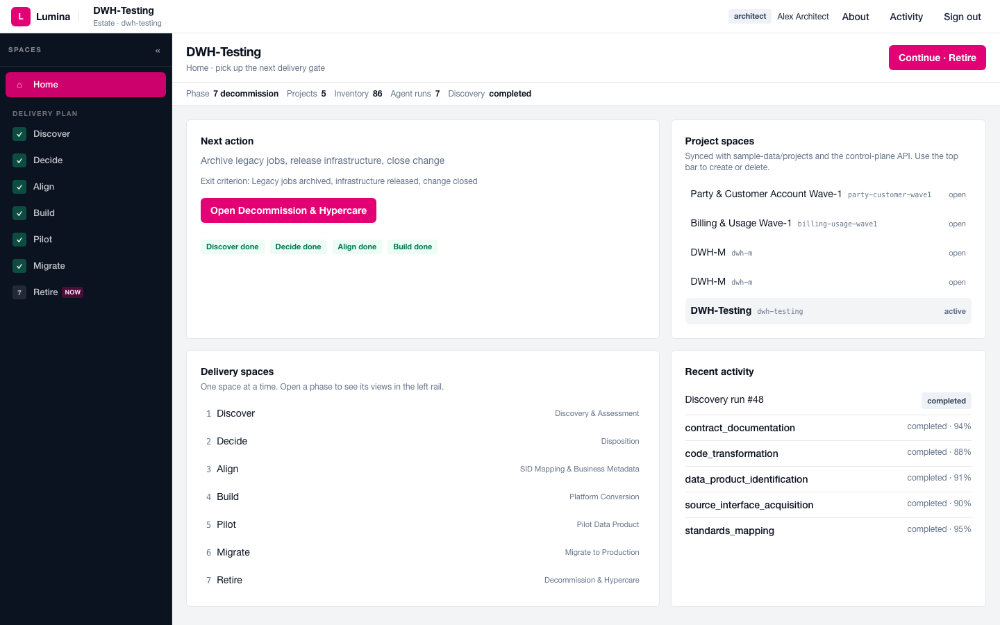
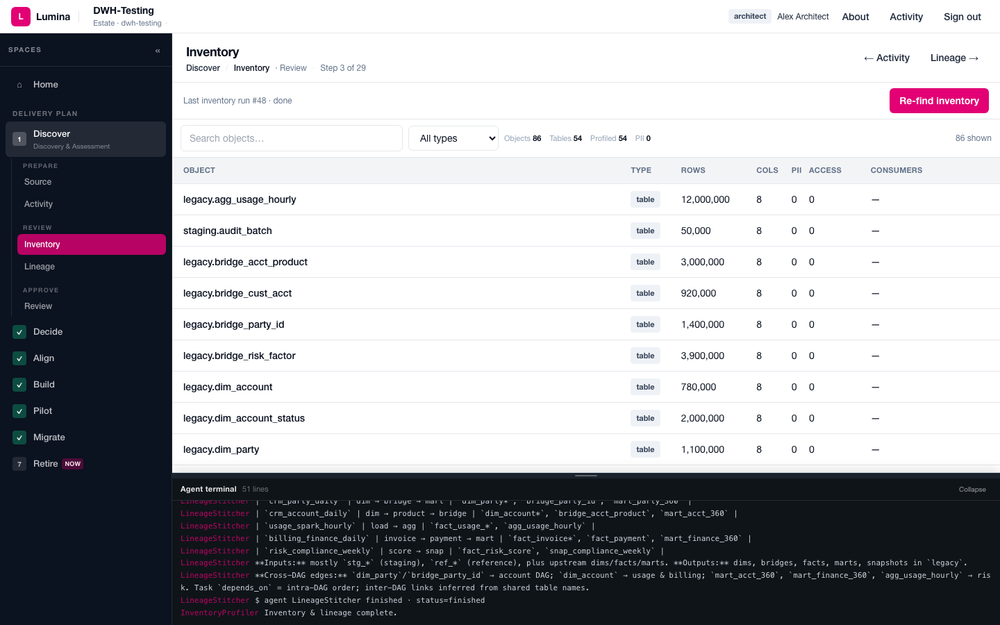
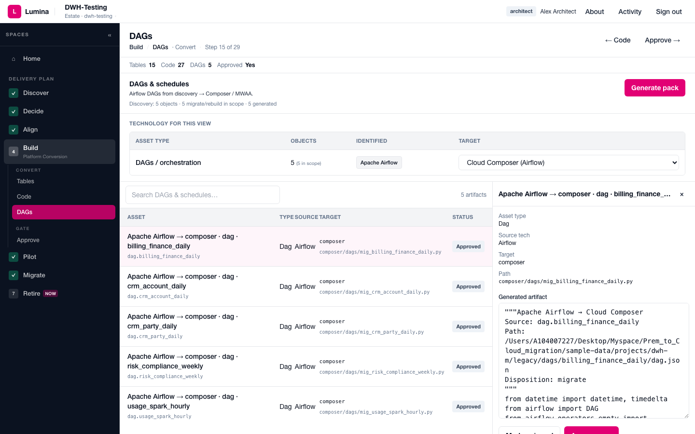
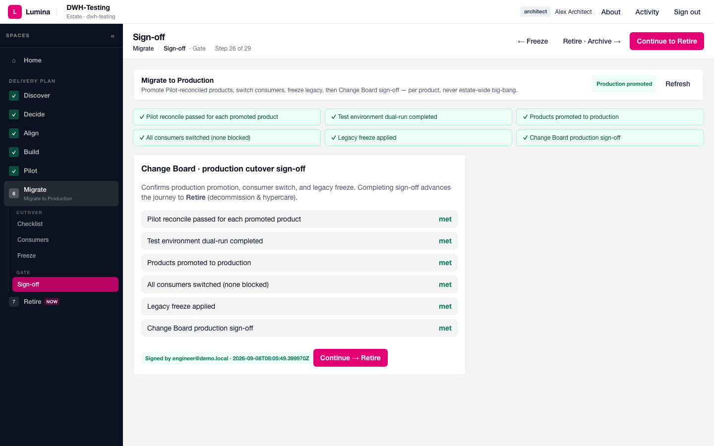

# From Legacy Estates to Governed Data Products  
### A control-plane approach for brownfield analytics modernisation

**White paper**  
**Lumina Control Plane**  
**Version 1.0 · September 2026**  
**Classification:** Public / externally publishable  

---

### About this paper

This paper sets out a practical operating model for modernising long-lived analytics estates — warehouses, ETL graphs, schedulers, and reporting marts — into **owned, contracted data products** on a cloud platform. It is written for executive sponsors, chief data officers, architecture boards, and programme leaders. The method is industry-agnostic; telecom examples (TM Forum SID, hub-and-spoke data platforms) illustrate a high-complexity case.

The approach is implemented in **Lumina**, an enterprise control plane that combines automated discovery, evidence-based disposition, reference-model alignment, human-in-the-loop approvals, and per-product cutover.

---

## 1. Executive summary

Most large organisations still run critical reporting and analytical workloads on legacy data estates. Those estates grew by accretion: cryptic naming, team-shaped schemas, procedural ETL, undeclared lineage, and weak business metadata. Cloud programmes often respond with **lift-and-shift** — copying tables and jobs into a new platform. The result is familiar: higher combined run cost, unresolved ownership, and little improvement in reuse or trust.

A better path treats modernisation as **productisation under governance**:

1. **Discover** what exists from code and runtime evidence, not from tribal documentation.  
2. **Decide** per object whether to migrate, rebuild, consolidate, archive, or retire.  
3. **Align** survivors to an industry or enterprise reference model and to accountable business metadata.  
4. **Build** platform-native artifacts (warehouse DDL, compute jobs, orchestration).  
5. **Pilot** source-aligned data products with contracts, dual-run, and reconciliation.  
6. **Migrate** per product — never big-bang — with consumer switch and legacy freeze.  
7. **Retire** frozen legacy so cost and risk actually leave the organisation.

Automation and large language models can accelerate drafting. They must not silently own boundaries, SLAs, or publication. **Human-in-the-loop gates** keep accountability with architects, data owners, product owners, and change authorities.

**Recommendation:** Establish a **migration control plane** as programme policy — disposition before build, standards before code generation, dual-run before production, and retirement as a first-class exit — rather than open-ended table migration factories.

---

## 2. Situation: the brownfield reality

Legacy analytics estates share a stable set of failure modes:

| Pattern | Typical evidence | Business consequence |
| --- | --- | --- |
| Encoded naming | Object names carry team, load type, region | Meaning lives in individuals |
| Org-chart schemas | Subject areas mirror reporting lines | Domains cannot reuse |
| Procedural wrappers | Shell/Control-M/Airflow outside clean VCS | Fragile change |
| Truncate-and-reload | Non-idempotent loads | High operational risk |
| Implicit lineage | Dependencies only in scheduler order | Impact analysis fails |
| Missing metadata | No owner, glossary, sensitivity, contract | No Marketplace-ready trust |
| Unmeasured usage | No query/report evidence | Everything “must migrate” |

Cloud platforms (object storage, columnar warehouses, managed Spark, managed Airflow, catalogues, marketplaces) solve **where** work runs. They do not, by themselves, solve **what** deserves to exist as a product.

---

## 3. Complication: three incomplete responses

Organisations typically buy or build one of three incomplete answers:

1. **Script factories** — accelerate code conversion without disposition. Dead weight moves; licences remain.  
2. **Catalogue-only programmes** — improve discoverability of what still should not exist.  
3. **Greenfield product studios** — excellent for new products; silent on the estate that funds today’s P&L and regulatory reporting.

Leading platform strategies correctly separate:

- **organisational shift** — work as data products (ownership, contracts, marketplace), and  
- **technology shift** — shared hub capabilities with domain-owned spokes.

What remains missing is the **control plane for brownfield transition**: a gated journey that turns evidence into decisions, decisions into standards-aligned products, and products into cutovers that finally retire legacy.

---

## 4. Governing idea

> **Do not migrate the estate. Migrate the products the estate was trying — and often failing — to be.**

That idea has four operational consequences:

1. **Retirement is success**, not failure.  
2. **Reference models beat tribal schemas** (for telecom: TM Forum Information Framework / SID).  
3. **Contracts beat tables** (schema, keys, freshness, quality, deprecation).  
4. **Agents draft; humans decide** — especially on ownership, boundaries, and go-live.

---

## 5. The control-plane method

### 5.1 End-to-end stages

| Stage | Intent | Exit evidence |
| --- | --- | --- |
| **Mobilise** | Access, RACI, freeze, platform bind | Ready for discovery |
| **Discover** | Inventory, lineage, jobs/DAGs, profiling, usage | Signed-off technical pack |
| **Decide** | Migrate / rebuild / consolidate / archive / retire | Approved register + benefits case |
| **Align** | Reference mapping + owner / definition / classification | Approved standards pack |
| **Build** | Convert survivors to target DDL, code, orchestration | Architect-approved conversion pack |
| **Pilot** | Contract, pipeline, dual-run, reconcile | Product within tolerance |
| **Migrate** | Promote, switch consumers, freeze legacy | Change authority sign-off |
| **Retire** | Archive, release infra, hypercare, close | Legacy cost/risk removed |

### 5.2 Disposition economics

Migration cost scales with object count. The cheapest object is the one **not** migrated.

| Disposition | When | Outcome |
| --- | --- | --- |
| Retire | No use, no retention, no dependents | Decommission path |
| Archive-only | Retention without active use | Cold storage, not warehouse |
| Consolidate | Near-duplicate | Single survivor |
| Migrate | Sound logic, active use | Translate |
| Rebuild | Active use, unsound/non-restartable logic | Re-implement from system of record |

A credible benefits case reports **avoidance percentage** alongside survivors — before cloud build spend is authorised.

### 5.3 Standards alignment

Survivors are mapped at domain, entity, and attribute levels to a reference model. Each row carries conformance (`conformant`, `conformant-with-extension`, `non-conformant justified`). Unmapped inventiveness is recorded as a **gap**, not silently normalised into a new enterprise standard.

Business metadata then supplies accountability: owner, steward, system of record, criticality, sensitivity, retention, freshness, known consumers.

### 5.4 Source-aligned data products

A source-aligned product represents one authoritative business entity close to its system of record — cleaned and conformed, **not** report-specific. Derivation rules:

- Start from the canonical entity, not the legacy table.  
- Never merge two sources of record into one product.  
- Publish a versioned contract; enforce classification at the boundary.  
- Keep consumer-specific logic in consumer-aligned products above.

### 5.5 Cutover discipline

- Dual-run with quantitative reconcile (row counts, keys, control totals, aggregates).  
- Cut over **per product**.  
- Switch consumers to the contract; freeze legacy; then archive.  
- Record production sign-off with residual risk and rollback ownership.

---

## 6. Human-in-the-loop and responsible automation

Automation should accelerate **evidence and drafts**. It must not invent ownership or auto-publish contracts.

| Automation prepares | Humans approve |
| --- | --- |
| Repository / estate scan | Scope and business context |
| Inventory + lineage | Candidate product / disposition review |
| Mapping and conversion proposals | Architect / owner decisions |
| Validation and readiness reports | Change authority go-live |

Operating rules for LLM-assisted work:

1. Minimum necessary context; no secrets or unrestricted personal data in prompts.  
2. Structured outputs with confidence and citations.  
3. Low-confidence items become review items, not instructions.  
4. Generated code is an engineer pull request — tests, lineage, security, reconcile.  
5. Platform execution reads only reviewed, version-controlled configuration.  
6. Prompt version, standards version, artifacts, reviewer, and decision are auditable.

This matches the quality bar used in mature brownfield packaging programmes: *agent drafts, engineer approves; no silent ownership, no fake SLAs, no auto-publication.*

---

## 7. Operating model fit

A durable platform operating model usually combines:

| Capability | Role |
| --- | --- |
| **Enablement** | Ways of working, coaching, clinics |
| **Local code-agent packs** | Make existing implementations discoverable and contract-ready |
| **Product builder** | Guided creation for new / platform-native products |
| **Migration control plane (Lumina)** | Brownfield disposition, standards alignment, build, pilot, cutover, retire |
| **Hub services** | Ingest, IAM, governance, perimeter / sovereignty |
| **Domain spokes** | Where products live and expose contracted ports |
| **Marketplace** | Publish, discover, subscribe |

Entry points differ; the destination does not: **owned, contracted, discoverable, reusable, operable** data products.

---

## 8. Architecture pattern (illustrative)

Platform-neutral layering with representative services:

| Layer | Intent | Examples |
| --- | --- | --- |
| Landing | Immutable capture | Cloud object storage |
| Warehouse | Analytical store | Columnar cloud warehouse |
| Compute | Heavy transforms | Managed Spark |
| Orchestration | DAG runtime | Managed Airflow |
| Governance | Catalogue, policy, lineage | Dataplex-class / IAM |
| Products | Contracts + ports | Marketplace publication |

In hub-and-spoke designs, the hub **governs**; domains **own** products. Internal build stages remain private; consumers depend only on contracted public ports.

---

## 9. Value case and metrics

Executives should insist on a scorecard, not a slide of ambition:

| Metric | Why it matters |
| --- | --- |
| % objects not migrated | Scope and cost control |
| Conformance score | Standards discipline |
| Dual-run reconcile pass rate | Cutover risk |
| Time from signed inventory to first product | Delivery speed |
| Consumers switched | Adoption reality |
| Legacy infra / licence released | True completion |
| Audit completeness of migration-repo | Regulatory defensibility |

Illustrative telecom Wave-1 products often include Party & Customer Account, Service Inventory, Usage Events, and Billing / Rated Events — each mapped to SID aggregates and cut over independently.

---

## 10. Risks and mitigations

| Risk | Mitigation |
| --- | --- |
| Shadow migration teams bypass gates | Mandate control-plane policy for funding |
| Over-trust in model outputs | HITL + confidence thresholds |
| Big-bang pressure from programmes | Per-product cutover as non-negotiable |
| Metadata theatre | Owner + classification as hard gates |
| Cloud cost without legacy exit | Retire phase funded and measured |
| Tool sprawl (three journeys, three truths) | Explicit complementarity and shared destination |

---

## 11. Implementation roadmap

| Horizon | Focus | Outcome |
| --- | --- | --- |
| **Foundation** | Mobilise, discover one estate, first disposition | Evidence pack + avoidance case |
| **First product** | Align + build + pilot | Dual-run within tolerance |
| **Production** | Promote, switch consumers, freeze, sign off, start retire | Controlled Wave-1 completion |
| **Scale** | Repeat waves; integrate packaging / builder tooling | Repeatable playbook across domains |

---

## 12. Conclusion

Cloud platforms and data-product operating models are necessary but not sufficient. Brownfield estates will dominate risk and cost until organisations install a **gated control plane** that makes disposition, standards, dual-run, and retirement as real as pipelines.

**Lumina** embodies that control plane: discover with evidence, decide with economics, align with standards, build with review, pilot with reconcile, migrate under change control, and retire with proof.

Organisations that treat migration as productisation shrink estates, raise trust, and fund platform adoption with avoided waste — not with hope.

---

## Appendix A — Glossary

| Term | Meaning |
| --- | --- |
| Brownfield | Existing implementation estate (code, jobs, data) |
| Disposition | Per-object migrate / rebuild / consolidate / archive / retire decision |
| HITL | Human-in-the-loop approval |
| ODPS / ODCS | Open data product / data contract specifications (illustrative) |
| SID | TM Forum Information Framework |
| Source-aligned product | Authoritative entity product near system of record |
| Control plane | Gated workflow + artifacts + roles coordinating delivery |

## Appendix B — Illustrative control-plane views

The following figures are captured from a working Lumina workspace.

*Figure B1 — Gated delivery plan and next action.*

*Figure B2 — Discovery inventory and lineage agents.*

*Figure B3 — Orchestration conversion (Airflow → managed Composer).*

*Figure B4 — Production readiness gates prior to retirement.*

## Appendix C — Authoring note

This paper is intended for global publication. Vendor and platform names are illustrative. Replace local programme names, tolerance thresholds, and Wave-1 product lists with organisation-specific figures before external release.

## Appendix D — Related practice

- Brownfield packaging: evidence scan → candidate products → human confirm → contract drafts → validate before publish  
- Platform evolution: shared hub capabilities; domain-owned product structures; marketplace as the front door for discovery and subscription  

---

*© 2026 Lumina Control Plane. Licensed for internal use and external publication with attribution.*
