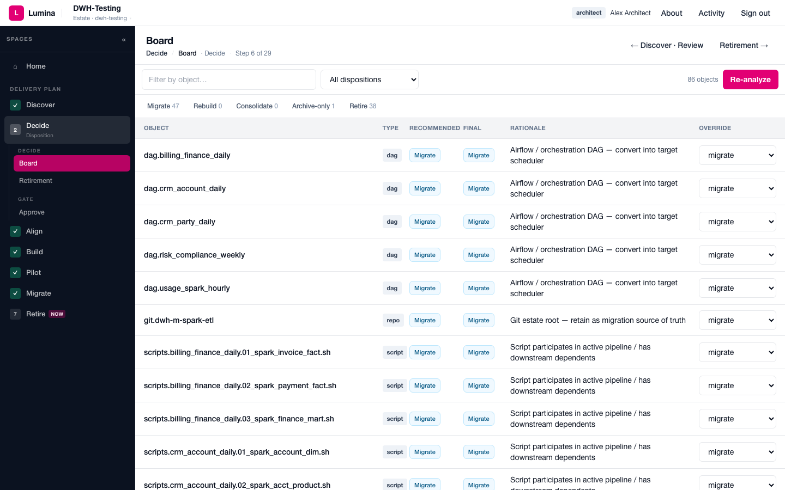
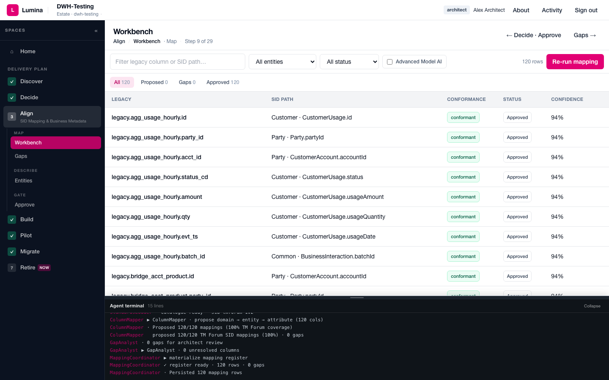
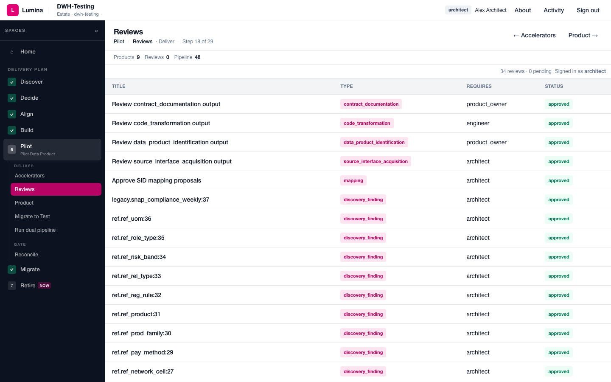

# Lumina documentation

Professional product materials for the Lumina Control Plane — legacy data estates to governed cloud data products.

## Contents

| Document | Description |
| --- | --- |
| [Product overview](./01-product-overview.md) | Concise description of Lumina, capabilities, and operating model |
| [Architecture](./02-architecture.md) | System context, control-plane layers, journey, integrations |
| [White paper](./Lumina-White-Paper.md) | Globally publishable practice paper on brownfield productisation |
| [Presentation (script)](./Lumina-Presentation.md) | Slide narrative and speaker notes |
| [Presentation (HTML)](./Lumina-Presentation.html) | Present-mode deck — arrow keys / click; `P` to print PDF |
| [Screenshots](./assets/screenshots/) | Captures from the working control-plane workspace |
| [Positioning notes](./00-positioning-notes.md) | Design-system alignment and complementary platform fit |

## Screenshots

| Capture | View |
| --- | --- |
|  | Home — delivery plan and next gate |
|  | Discover — inventory & lineage agents |
|  | Decide — disposition board |
|  | Align — SID mapping workbench |
|  | Build — DAG conversion pack |
|  | Pilot — review inbox |
|  | Migrate — production readiness gates |

## Design system

- Magenta `#E20074` · Ink `#0B1220` · IBM Plex Sans  
- Table-first workspace · role-gated approvals · durable migration artifacts  

## Refresh screenshots

With UI on `:3000` and API on `:8000`:

```bash
node Docs/assets/capture-screenshots.mjs
```
