# Mirage Suite — Executive Briefing

**Duration:** 20–25 minutes  
**Visual deck:** [Mirage_Suite_Deck.pdf](./Mirage_Suite_Deck.pdf) · [Mirage_Suite_Deck.pptx](./Mirage_Suite_Deck.pptx)  
**Brand:** Magenta `#E20074` · Ink `#0B1220`  
**Macro journey:** Discover → Decide → Deliver → Retire  

This document is the searchable transcript and talk track for the 15-slide Executive Briefing. Present from the PDF/PPTX; use this file for rehearsal, review, and Docs alignment.

Further reading: [Product overview](../product/overview.md) · [Architecture](../engineering/architecture.md) · [White paper](../product/white-paper.md) · [Slide map](./slide-map.md) · [Visual catalog](./visual-catalog.md) · [Engagement next steps](./engagement-next-steps.md)

Deck slide images: [`assets/deck/slides/`](../assets/deck/slides/).

---

## Slide 1 — Vision

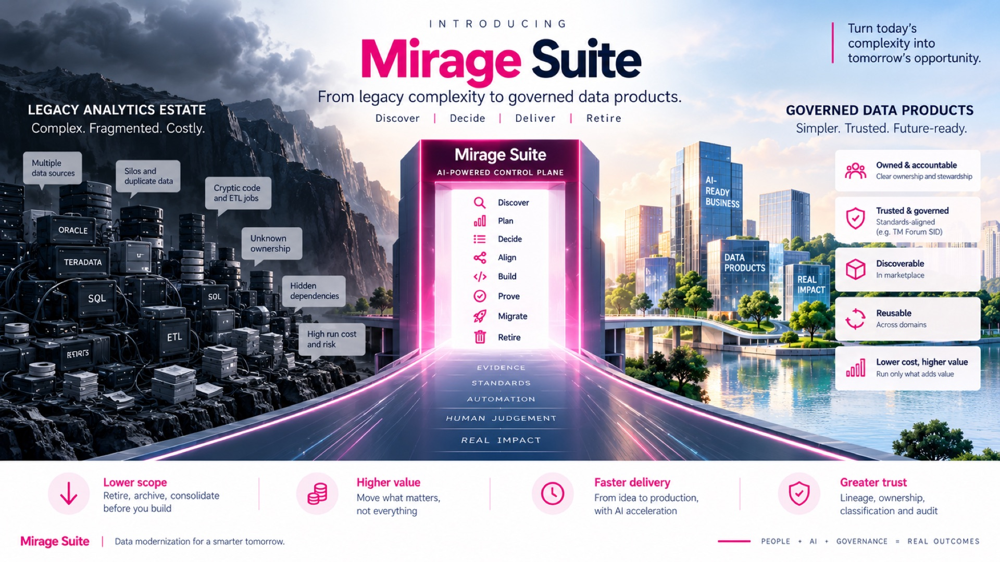
*Full Executive Briefing slide. Visual inventory: [visual-catalog.md § Slide 1](./visual-catalog.md#slide-1--from-legacy-complexity-to-governed-data-products).*

**On the slide:** Split landscape (legacy rocks → magenta portal → governed city); eight stage labels in the portal; five pathway pillars; bottom four-outcome strip; footer equation People + AI + Governance.

**Title:** From legacy complexity to governed data products  
**Eyebrow:** AI-powered control plane · Discover | Decide | Deliver | Retire

### Left — Legacy analytics estate

Complex. Fragmented. Costly.

- Multiple data sources (Oracle, Teradata, SQL, ETL, reports)
- Silos and duplicate data
- Cryptic code and ETL jobs
- Unknown ownership
- Hidden dependencies
- High run cost and risk

### Centre — Mirage Suite

Pathway pillars: **Evidence · Standards · Automation · Human judgement · Real impact**

Tool chain through the portal: Discover · Plan · Decide · Align · Build · Prove · Migrate · Retire

### Right — Governed data products

Simpler. Trusted. Future-ready.

- Owned & accountable
- Trusted & governed (e.g. TM Forum SID)
- Discoverable in marketplace
- Reusable across domains
- Lower cost, higher value

### Bottom outcomes strip

| Lower scope | Higher value | Faster delivery | Greater trust |
| --- | --- | --- | --- |
| Retire, archive, consolidate before you build | Move what matters, not everything | From idea to production, with AI acceleration | Lineage, ownership, classification, and audit |

**Footer:** Mirage Suite | Data modernization for a smarter tomorrow · People + AI + Governance = Real outcomes

**Talk track:** Open with the before/after picture. Mirage is not another converter — it is the gated control plane between estate chaos and owned products.

---

## Slide 2 — Control plane for brownfield

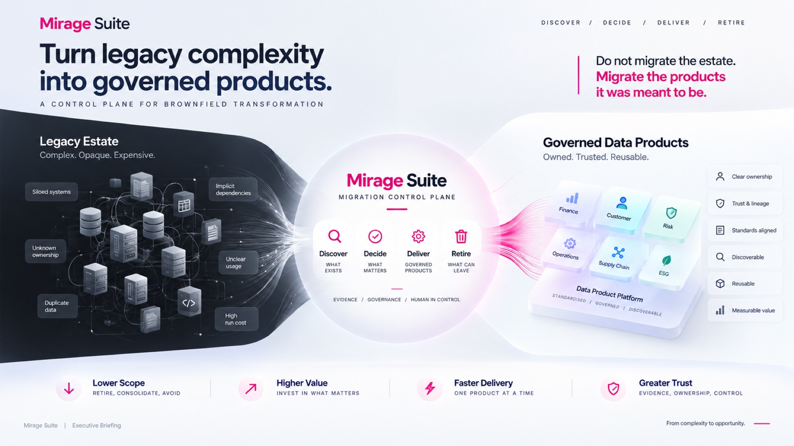
*Full Executive Briefing slide. Visual inventory: [visual-catalog.md § Slide 2](./visual-catalog.md#slide-2--turn-legacy-complexity-into-governed-products).*

**On the slide:** Chaotic dependency web (left); glowing Discover/Decide/Deliver/Retire hub; 3D product platform with six domain cubes (Finance, Operations, Customer, Supply Chain, Risk, ESG); bottom outcome strip.

**Headline:** Turn legacy complexity into governed products.  
**Sub:** A control plane for brownfield transformation.

**Callout:** Do not migrate the estate. **Migrate the products it was meant to be.**

| Legacy estate | Mirage Suite | Governed data products |
| --- | --- | --- |
| Complex · Opaque · Expensive | Migration control plane | Owned · Trusted · Reusable |
| Siloed systems, unknown ownership, duplicates, implicit dependencies, unclear usage, high run cost | **Discover** what exists · **Decide** what matters · **Deliver** governed products · **Retire** what can leave | Clear ownership, trust & lineage, standards aligned, discoverable, reusable, measurable value |
| | Evidence / Governance / Human in control | Standardised · Governed · Discoverable (Finance, Operations, Customer, Supply Chain, Risk, ESG …) |

**Outcomes:** Lower scope (retire, consolidate, avoid) · Higher value · Faster delivery (one product at a time) · Greater trust

**Talk track:** Repeat the governing idea. Emphasize Discover / Decide / Deliver / Retire as the executive vocabulary.

---

## Slide 3 — The brownfield reality

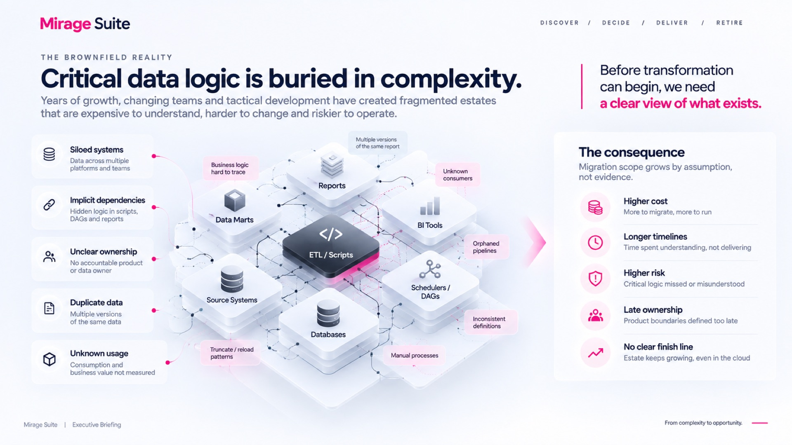
*Full Executive Briefing slide. Visual inventory: [visual-catalog.md § Slide 3](./visual-catalog.md#slide-3--the-brownfield-reality).*

**On the slide:** Isometric estate with ETL/Scripts core and six surrounding blocks; red pain callouts (orphaned pipelines, truncate/reload, etc.); left root causes; right consequences.

**Headline:** Critical data logic is buried in complexity.  
**Sub:** Before you transform, you need a clear view of what exists.

### Root causes

1. Siloed systems  
2. Implicit dependencies (scripts, DAGs, reports)  
3. Unclear ownership  
4. Duplicate data  
5. Unknown usage  

### Estate shape (centre)

ETL / Scripts at the centre, surrounded by Reports, BI tools, Schedulers / DAGs, Databases, Source systems, Data marts — with pain labels: hard-to-trace logic, multiple report versions, unknown consumers, orphaned pipelines, inconsistent definitions, manual processes, truncate/reload patterns.

### Consequences

Migration scope grows by **assumption**, not evidence:

- Higher cost  
- Longer timelines  
- Higher risk  
- Late ownership  
- No clear finish line  

**Talk track:** Spend time on “unknown usage” and “no finish line” — these sell disposition and retirement as first-class.

---

## Slide 4 — Incomplete approaches

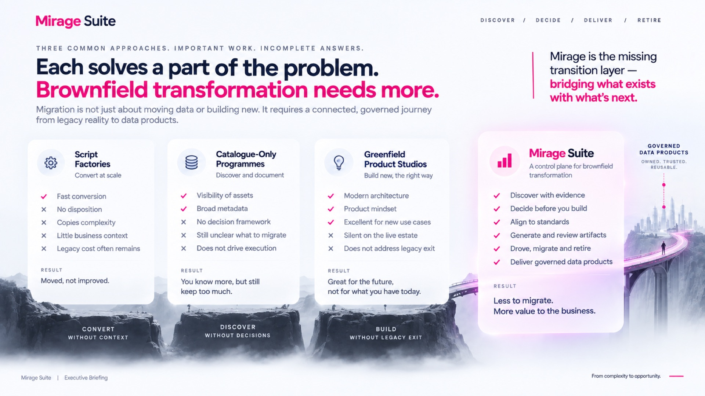
*Full Executive Briefing slide. Visual inventory: [visual-catalog.md § Slide 4](./visual-catalog.md#slide-4--three-common-approaches--incomplete-answers).*

**On the slide:** Four comparison cards with check/X lists; magenta glow on Mirage card; bridge-to-city metaphor labeled GOVERNED DATA PRODUCTS.

**Headline:** Three common approaches. Important work. Incomplete answers.  
**Sub:** Each solves a part of the problem. Brownfield transformation needs more.

**Quote:** Mirage is the missing transition layer — bridging what exists with what’s next.

| Approach | Strengths | Gaps | Result |
| --- | --- | --- | --- |
| **Script factories** — convert at scale | Fast conversion | No disposition; copies complexity; little business context; legacy cost often remains | Moved, not improved |
| **Catalogue-only programmes** — discover and document | Visibility; broad metadata | No decision framework; unclear what to migrate; does not drive execution | You know more, but still keep too much |
| **Greenfield product studios** — build new, the right way | Modern architecture; product mindset; excellent for new use cases | Silent on the live estate; no legacy exit | Great for the future, not for today |
| **Mirage Suite** — control plane for brownfield | Discover with evidence; decide before build; align to standards; generate and review; migrate and retire; deliver governed products | — | Less to migrate. More value to the business. |

**Talk track:** Do not attack adjacent tools — position Mirage as the missing *transition* layer that connects them.

---

## Slide 5 — Nine-tool journey

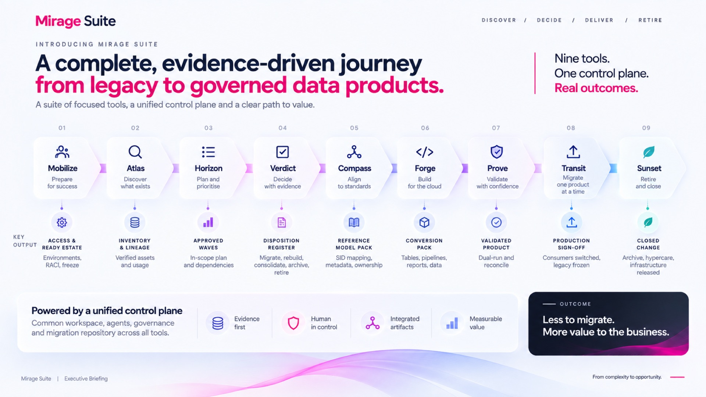
*Full Executive Briefing slide. Visual inventory: [visual-catalog.md § Slide 5](./visual-catalog.md#slide-5--nine-tool-evidence-driven-journey).*

**On the slide:** Nine numbered tool arrows with key-output stacks; unified control-plane bar; four principle icons; OUTCOME box.

**Headline:** A complete, evidence-driven journey from legacy to governed data products.  
**Sub:** A suite of focused tools, a unified control plane, and a clear path to value.

| # | Tool | Job | Key output |
| --- | --- | --- | --- |
| 01 | **Mobilize** | Prepare for success | Access & ready estate — environments, RACI, freeze |
| 02 | **Atlas** | Discover what exists | Inventory & lineage — verified assets and usage |
| 03 | **Horizon** | Plan and prioritise | Approved waves — in-scope plan and dependencies |
| 04 | **Verdict** | Decide with evidence | Disposition register — migrate, rebuild, consolidate, archive, retire |
| 05 | **Compass** | Align to standards | Reference model pack — SID mapping, metadata, ownership |
| 06 | **Forge** | Build for the cloud | Conversion pack — tables, pipelines, reports, docs |
| 07 | **Prove** | Validate with confidence | Validated product — dual-run and reconcile |
| 08 | **Transit** | Migrate one product at a time | Production sign-off — consumers switched, legacy frozen |
| 09 | **Sunset** | Retire and close | Closed change — archive, hypercare, infrastructure released |

**Control plane:** Common workspace, agents, governance, and migration repository across all tools.

**Principles:** Evidence first · Human in control · Integrated artifacts · Measurable value  

**Outcome:** Less to migrate. More value to the business.

**Talk track:** Walk 01→09 quickly; pause on Horizon (waves) and Sunset (exit). Note MVP depth may vary by tool — see product overview footnote.

---

## Slide 6 — Executive outcomes

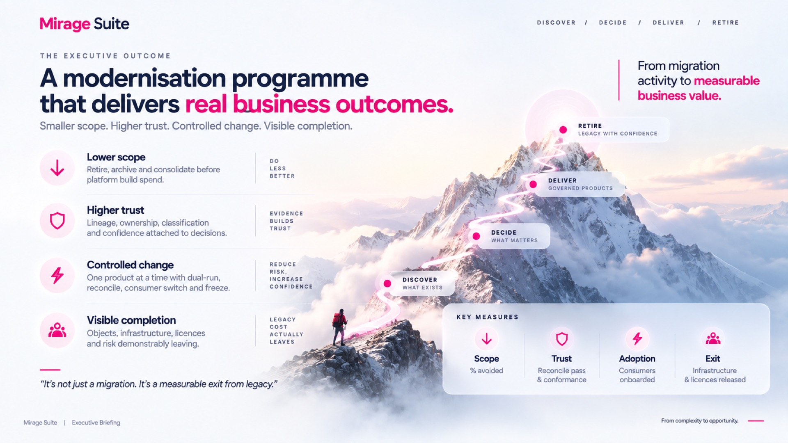
*Full Executive Briefing slide. Visual inventory: [visual-catalog.md § Slide 6](./visual-catalog.md#slide-6--executive-outcomes--key-measures).*

**On the slide:** Four outcome rows with tags (Do less better, etc.); mountain path with four stage markers; KEY MEASURES box (Scope / Trust / Adoption / Exit).

**Headline:** The executive outcome: a modernisation programme that delivers **real business outcomes**.  
**Sub:** Smaller scope. Higher trust. Controlled change. Visible completion.

| Outcome | Meaning | Tag |
| --- | --- | --- |
| **Lower scope** | Retire, archive and consolidate before platform build spend | Do less better |
| **Higher trust** | Lineage, ownership, classification and confidence attached to decisions | Evidence builds trust |
| **Controlled change** | One product at a time with dual-run, reconcile, consumer switch and freeze | Reduce risk, increase confidence |
| **Visible completion** | Objects, infrastructure, licences and risk demonstrably leaving | Legacy cost actually leaves |

**Quote:** It’s not just a migration. It’s a measurable exit from legacy.

### Key measures

| Measure | Signal |
| --- | --- |
| Scope | % avoided |
| Trust | Reconcile pass & conformance |
| Adoption | Consumers onboarded |
| Exit | Infrastructure & licences released |

**Talk track:** Tie every later demo to one of these four measures.

---

## Slide 7 — Architecture

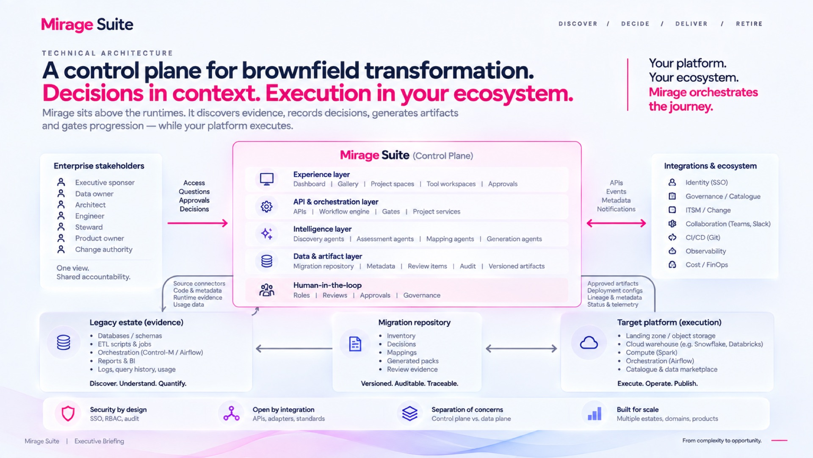
*Full Executive Briefing slide. Visual inventory: [visual-catalog.md § Slide 7](./visual-catalog.md#slide-7--control-plane-architecture).*

**On the slide:** Full context diagram — stakeholders, legacy evidence, five Mirage layers, integrations ecosystem, target platform, migration repository, four principles.

**Headline:** Control plane for brownfield transformation. Decisions and artifacts in Mirage; execution on your platform.

### Stakeholders (left)

Executive sponsor · Data owner · Architect · Engineer · Steward · Product owner · Change authority  
→ Access, questions, approvals, decisions

### Legacy estate (evidence)

Databases / schemas · ETL scripts & jobs · Orchestration (Control-M, Airflow) · Reports & BI · Logs / usage  
→ Source connectors, code & metadata, runtime evidence, usage data

### Mirage Suite layers

| Layer | Contents |
| --- | --- |
| Experience | Dashboard, Gallery, project spaces, tool workspaces, approvals |
| API & orchestration | APIs, workflow engine, gates, project services |
| Intelligence | Discovery, assessment, mapping, generation agents |
| Data & artifact | Migration repository, metadata, review items, audit, versioned artifacts |
| Human-in-the-loop | Roles, reviews, approvals, governance |

### Integrations & ecosystem

CI/CD (Git) · Identity (SSO) · Governance / Catalogue · ITSM / Change · Collaboration · Observability · Cost / FinOps

### Target platform (execution)

Landing zones · Cloud warehouses · Compute (Spark) · Orchestration (Airflow) · Catalogues  
← Approved artifacts, deployment configs, lineage & metadata, status & telemetry

### Migration repository

Inventory · Decisions · Mappings · Generated packs · Review evidence — versioned, auditable, traceable

### Principles

Security by design (SSO, RBAC, audit) · Open by integration · Separation of concerns (control vs data plane) · Built for scale

**Talk track:** Stress control plane vs data plane once. Point engineers to [architecture.md](../engineering/architecture.md).

---

## Slide 8 — End-to-end journey

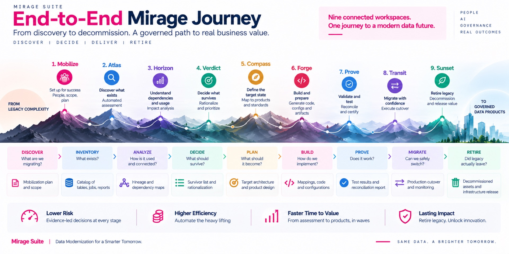
*Full Executive Briefing slide. Visual inventory: [visual-catalog.md § Slide 8](./visual-catalog.md#slide-8--end-to-end-mirage-journey).*

**On the slide:** Mountain path with nine stage pins; lower grid of actions / key questions / deliverables; four benefit strip.

**Headline:** From legacy complexity to governed data products — nine connected workspaces.

| # | Tool | Objective |
| --- | --- | --- |
| 1 | Mobilize | Set up for success (people, scope, plan) |
| 2 | Atlas | Discover what exists (automated assessment) |
| 3 | Horizon | Understand dependencies and usage (impact analysis) |
| 4 | Verdict | Decide what survives (rationalise and prioritise) |
| 5 | Compass | Define the target state (map to products and standards) |
| 6 | Forge | Build and prepare (generate code, configs, artifacts) |
| 7 | Prove | Validate and test (reconcile and certify) |
| 8 | Transit | Migrate with confidence (execute cutover) |
| 9 | Sunset | Retire legacy (decommission and release value) |

**Benefits strip:** Lower risk · Higher efficiency · Faster time to value · Lasting impact  

**Talk track:** Optional deep-dive slide if audience is method-heavy; otherwise one pass then move to experience.

---

## Slide 9 — Platform experience (target)

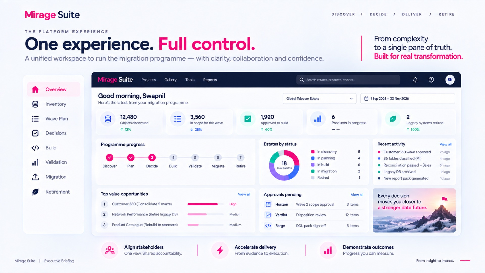
*Full Executive Briefing slide. **Target / illustrative UI — not current MVP.** Visual inventory: [visual-catalog.md § Slide 9](./visual-catalog.md#slide-9--platform-experience-target).*

**On the slide:** Mock dashboard chrome (sidebar, KPIs, donut, activity, approvals). Do not treat KPI numbers as product metrics — use [screenshots](../assets/screenshots/) for live proof.

**Headline:** One experience. Full control.  
**Sub:** A unified workspace to run the migration programme — with clarity, collaboration and confidence.

> **Honesty note:** This slide is a **target experience** mock for the briefing. It is not a claim that every KPI widget ships in the current MVP. For proof of the working product, use [assets/screenshots/](../assets/screenshots/) (e.g. portfolio Dashboard home).

Illustrative programme chrome: Overview · Inventory · Wave Plan · Decisions · Build · Validation · Migration · Retirement; portfolio KPIs; estates-by-status; approvals pending (Horizon / Verdict / Forge).

**Footer value props:** Align stakeholders · Accelerate delivery · Demonstrate outcomes

**Talk track:** Show the live app when possible; use this slide only as “where the programme is going.”

---

## Slide 10 — Connected suite of tools

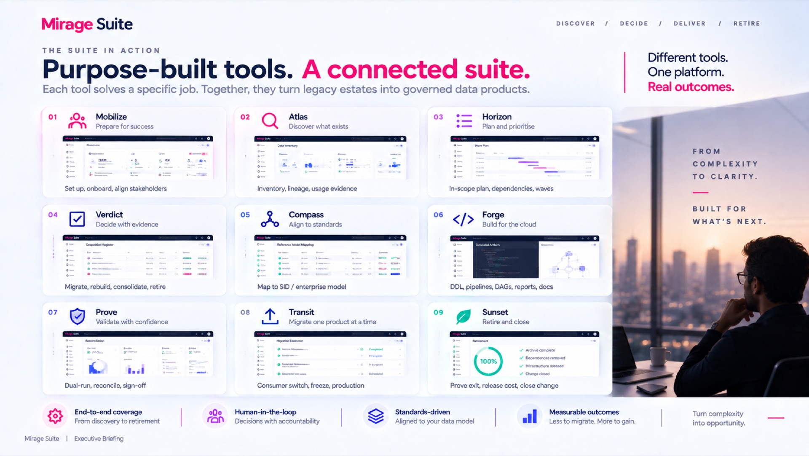
*Full Executive Briefing slide. Thumbnails are **illustrative UI**. Visual inventory: [visual-catalog.md § Slide 10](./visual-catalog.md#slide-10--connected-suite-of-nine-tools).*

**On the slide:** 3×3 tool cards with icons and UI thumbnails; right hero photo panel; four pillar strip.

**Headline:** Different tools. One platform. Real outcomes.

| # | Tool | Tagline | Functions |
| --- | --- | --- | --- |
| 01 | Mobilize | Prepare for success | Set up, onboard, align stakeholders |
| 02 | Atlas | Discover what exists | Inventory, lineage, usage evidence |
| 03 | Horizon | Plan and prioritise | In-scope plan, dependencies, waves |
| 04 | Verdict | Decide with evidence | Migrate, rebuild, consolidate, retire |
| 05 | Compass | Align to standards | Map to SID / enterprise model |
| 06 | Forge | Build for the cloud | DDL, pipelines, DAGs, reports, docs |
| 07 | Prove | Validate with confidence | Dual-run, reconcile, sign-off |
| 08 | Transit | Migrate one product at a time | Consumer switch, freeze, production |
| 09 | Sunset | Retire and close | Prove exit, release cost, close change |

**Pillars:** End-to-end coverage · Human-in-the-loop · Standards-driven · Measurable outcomes  

**Talk track:** If demoing, jump from this grid into Atlas → Verdict → Forge → Transit screenshots.

---

## Slide 11 — Business impact

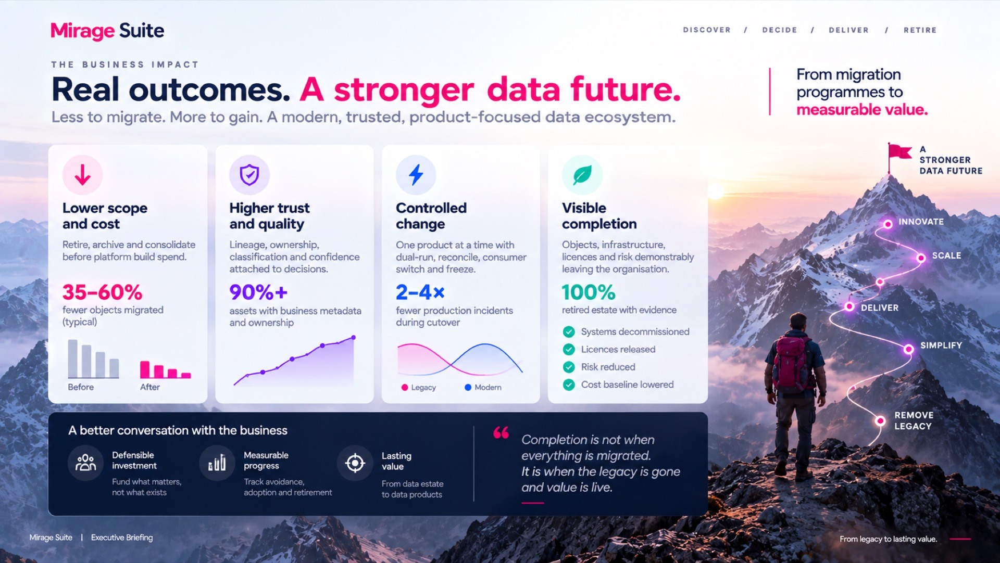
*Full Executive Briefing slide. Stats are **illustrative**. Visual inventory: [visual-catalog.md § Slide 11](./visual-catalog.md#slide-11--business-impact-illustrative).*

**On the slide:** Four benefit columns with mini-charts/checklist; business-conversation bar; path Remove legacy → Simplify → Deliver → Scale → Innovate.

**Headline:** Real outcomes. A stronger data future.  
**Sub:** Less to migrate. More to gain.

> Figures below are **illustrative / typical programme** outcomes for briefing — not contractual product guarantees.

| Benefit | Description | Illustrative signal |
| --- | --- | --- |
| Lower scope and cost | Retire, archive and consolidate before platform build spend | **35–60%** fewer objects migrated (typical) |
| Higher trust and quality | Lineage, ownership, classification and confidence attached to decisions | **90%+** assets with business metadata and ownership |
| Controlled change | One product at a time with dual-run, reconcile, consumer switch and freeze | **2–4×** fewer production incidents during cutover |
| Visible completion | Objects, infrastructure, licences and risk demonstrably leaving | **100%** retired estate with evidence |

**Business conversation:** Defensible investment · Measurable progress · Lasting value  

**Quote:** Completion is not when everything is migrated. It is when the legacy is gone and value is live.

**Path metaphor:** Remove legacy → Simplify → Deliver → Scale → Innovate → A stronger data future

**Talk track:** Always say “illustrative” aloud. Offer to replace with customer baseline metrics.

---

## Slide 12 — Human-in-the-loop

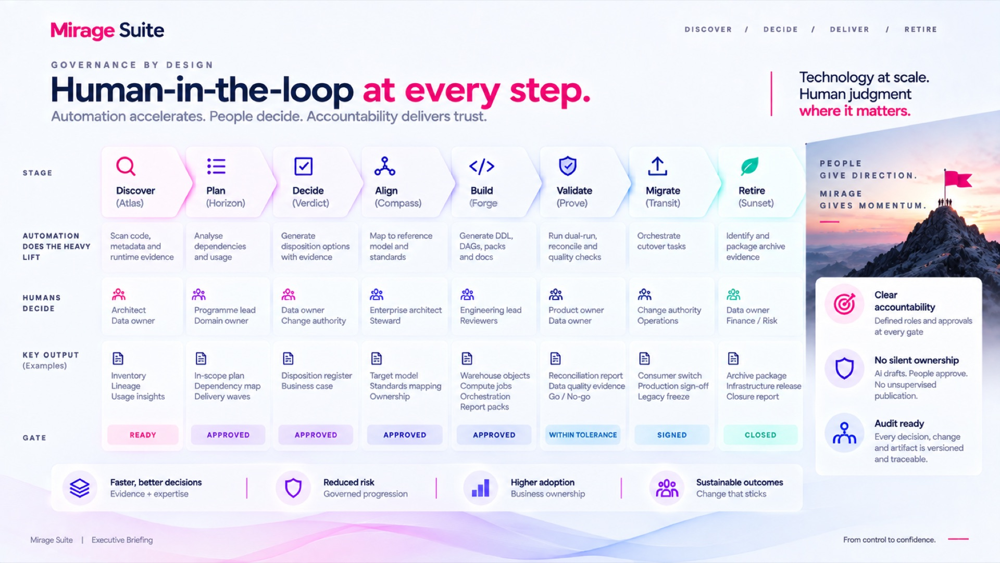
*Full Executive Briefing slide. Visual inventory: [visual-catalog.md § Slide 12](./visual-catalog.md#slide-12--human-in-the-loop-matrix).*

**On the slide:** Eight-column automation/humans/output/gate matrix; summit photo sidebar; four benefit strip.

**Headline:** Human-in-the-loop at every step. Governance by design.  
**Tagline:** Automation accelerates. People decide. Accountability delivers trust.

| Stage | Automation | Humans | Output | Gate |
| --- | --- | --- | --- | --- |
| Discover (Atlas) | Scans code, metadata, runtime evidence | Architect, Data owner | Inventory, lineage, usage | Ready |
| Plan (Horizon) | Analyses dependencies and usage | Programme lead, Domain owner | In-scope plan, dependency map, waves | Approved |
| Decide (Verdict) | Disposition options with evidence | Data owner, Change authority | Disposition register, business case | Approved |
| Align (Compass) | Maps to reference models / standards | Enterprise architect, Steward | Target model, mapping, ownership | Approved |
| Build (Forge) | Generates DDL, DAGs, packs, docs | Engineering lead, Reviewers | Warehouse, compute, orchestration, report packs | Approved |
| Validate (Prove) | Dual-run, reconciliation, quality checks | Product owner, Data owner | Reconcile report, DQ evidence, go/no-go | Within tolerance |
| Migrate (Transit) | Orchestrates cutover tasks | Change authority, Operations | Consumer switch, prod sign-off, freeze | Signed |
| Retire (Sunset) | Packages archive evidence | Data owner, Finance / Risk | Archive package, infra release, closure | Closed |

**Sidebar:** Clear accountability · No silent ownership · Audit ready  

**Benefits:** Faster, better decisions · Reduced risk · Higher adoption · Sustainable outcomes  

**Talk track:** This is the governance slide for risk, audit, and change boards.

---

## Slide 13 — Operating model fit

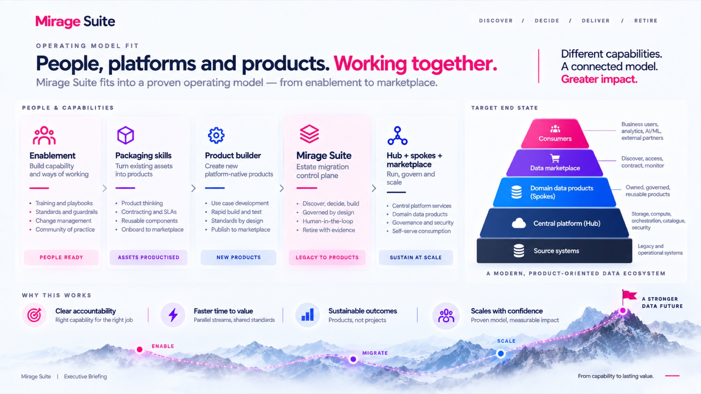
*Full Executive Briefing slide. Visual inventory: [visual-catalog.md § Slide 13](./visual-catalog.md#slide-13--operating-model-fit).*

**On the slide:** Five capability flow cards with outcomes; hub/spoke pyramid; Enable → Migrate → Scale mountain path.

**Headline:** People, platforms and products. Working together.  
**Sub:** Estate migration control plane — from enablement to marketplace.

| Capability | Focus | Outcome |
| --- | --- | --- |
| Enablement | Training, playbooks, standards, change, community | People ready |
| Packaging skills | Product thinking, contracts/SLAs, reusable components, marketplace onboard | Assets productised |
| Product builder | Use cases, rapid build/test, standards by design, publish | New products |
| **Mirage Suite** | Discover, decide, build; governed by design; HITL; retire with evidence | Legacy → products |
| Hub + spokes + marketplace | Central platform, domain products, governance, self-serve | Sustain at scale |

### Target ecosystem (pyramid)

Consumers → Data marketplace → Domain data products / spokes → Central platform / hub → Source systems

**Why this works:** Clear accountability · Faster time to value · Sustainable outcomes · Scales with confidence  

**Journey:** Enable → Migrate → Scale → A stronger data future

**Talk track:** Position Mirage beside enablement and product builder — not instead of them. See [positioning.md](../product/positioning.md).

---

## Slide 14 — Implementation roadmap

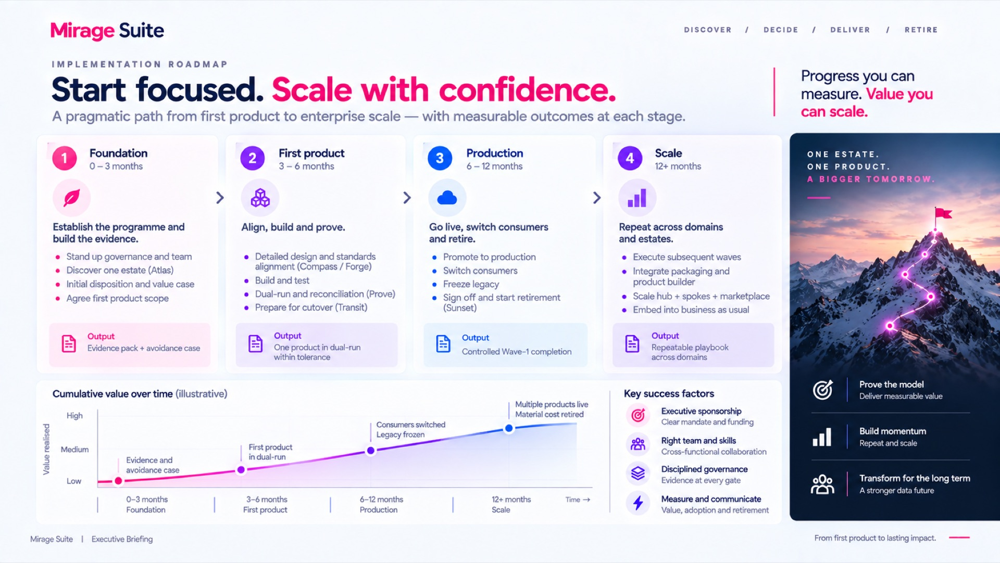
*Full Executive Briefing slide. Visual inventory: [visual-catalog.md § Slide 14](./visual-catalog.md#slide-14--implementation-roadmap).*

**On the slide:** Four roadmap stage cards; illustrative cumulative value line chart; success-factor icons; dark right rail.

**Headline:** Start focused. Scale with confidence.  
**Sub:** A pragmatic path from first product to enterprise scale.

| Stage | Window | Goal | Activities | Output |
| --- | --- | --- | --- | --- |
| **1 Foundation** | 0–3 months | Establish the programme and build the evidence | Stand up governance and team; Discover one estate (Atlas); Initial disposition and value case; Agree first product scope | Evidence pack + avoidance case |
| **2 First product** | 3–6 months | Align, build and prove | Compass / Forge design; Build and test; Dual-run (Prove); Prepare cutover (Transit) | One product in dual-run within tolerance |
| **3 Production** | 6–12 months | Go live, switch consumers and retire | Promote; Switch consumers; Freeze legacy; Sign off and start Sunset | Controlled Wave-1 completion |
| **4 Scale** | 12+ months | Repeat across domains and estates | Subsequent waves; Integrate packaging / product builder; Scale hub + spokes + marketplace; Embed BAU | Repeatable playbook |

### Success factors

- Executive sponsorship  
- Right team and skills  
- Disciplined governance (evidence at every gate)  
- Measure and communicate (value, adoption, retirement)  

**Talk track:** Offer to tailor windows to the customer’s wave size; keep the sequence.

---

## Slide 15 — Next steps

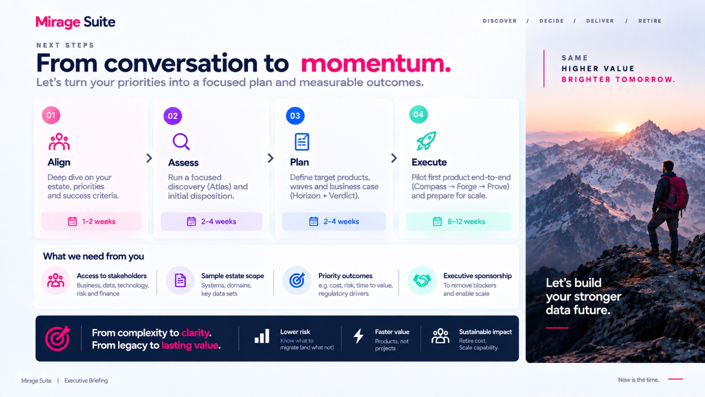
*Full Executive Briefing slide. Visual inventory: [visual-catalog.md § Slide 15](./visual-catalog.md#slide-15--next-steps--engagement). One-pager: [engagement-next-steps.md](./engagement-next-steps.md).*

**On the slide:** Four next-step cards with timelines; “What we need from you” row; dark value bar; hero photo panel.

**Headline:** Next steps. From conversation to momentum.  
**Sub:** Turn priorities into a focused plan and measurable outcomes.

| Step | Focus | Window |
| --- | --- | --- |
| **01 Align** | Deep dive on estate, priorities and success criteria | 1–2 weeks |
| **02 Assess** | Focused discovery (Atlas) and initial disposition | 2–4 weeks |
| **03 Plan** | Target products, waves and business case (Horizon + Verdict) | 2–4 weeks |
| **04 Execute** | Pilot first product end-to-end (Compass → Forge → Prove) and prepare for scale | 8–12 weeks |

### What we need from you

- Access to stakeholders (business, data, technology, risk, finance)  
- Sample estate scope (systems, domains, key data sets)  
- Priority outcomes (cost, risk, time to value, regulatory drivers)  
- Executive sponsorship to remove blockers and enable scale  

**Close:** From complexity to clarity. From legacy to lasting value.  
Lower risk · Faster value · Sustainable impact  

**Talk track:** End with a concrete ask — Align kickoff date and stakeholder list.

---

## Close checklist for presenters

1. Governing idea stated at least twice.  
2. Nine tools named in order (Mobilize → Sunset).  
3. Control plane ≠ data plane said once.  
4. Illustrative metrics labelled as such.  
5. Point to live product or real screenshots — not only slide 9 mock.  
6. Leave with Align / Assess next-step ask.
