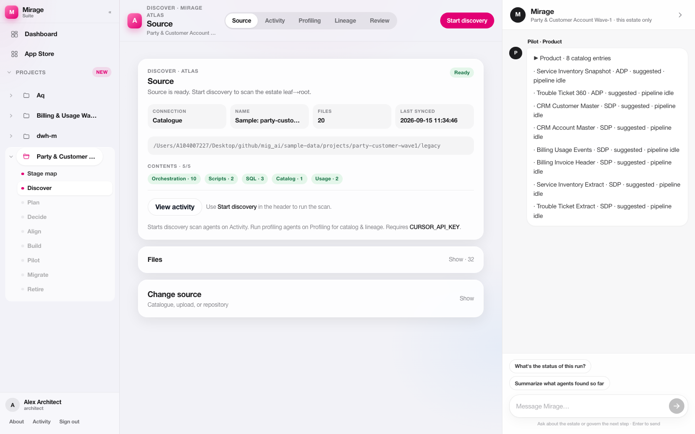
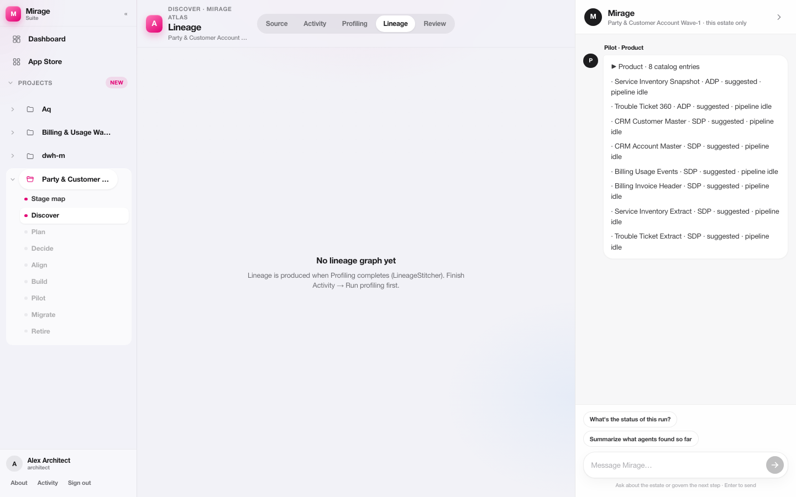
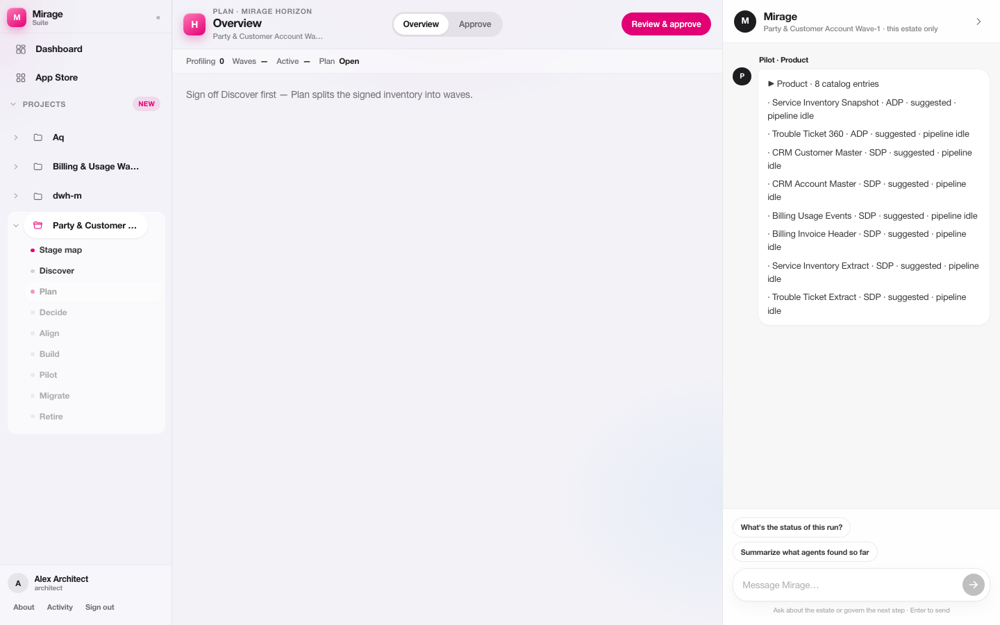
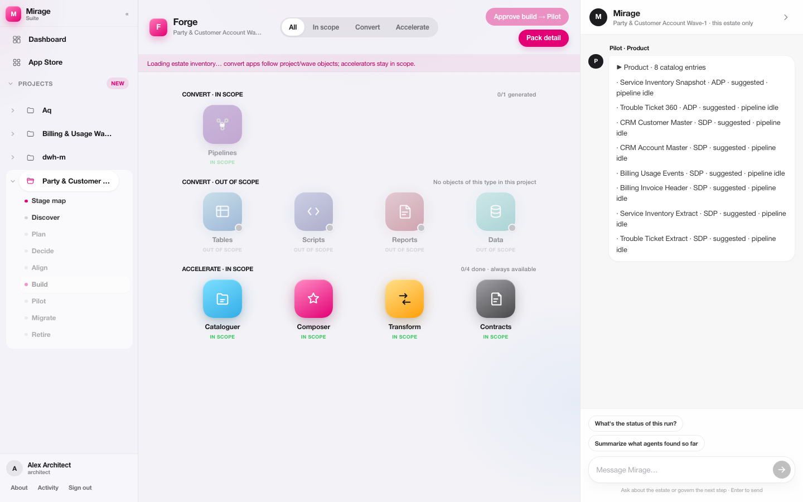
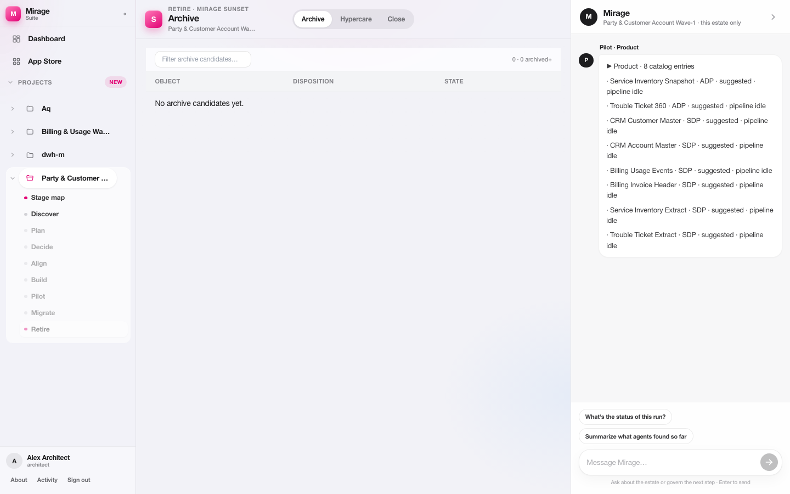

# Mirage Suite — product overview

**Mirage Suite** is an enterprise **AI-powered control plane** for transitioning legacy analytics estates — warehouses, ETL graphs, schedulers, and reporting marts — into **owned, contracted data products** on a cloud platform.

It is deliberately **not** lift-and-shift. Every object is discovered with evidence, planned into waves, dispositioned, aligned to standards where it survives, converted to target-platform artifacts, validated under dual-run, cut over per product, and retired when legacy cost and risk can leave.

**Macro journey:** Discover → Decide → Deliver → Retire  

**Governing idea:** Do not migrate the estate. Migrate the products it was meant to be.

After login, users land on the **portfolio Dashboard**, open the estate **Stage map** (gallery), then work inside one **named tool** at a time. Shell chrome includes **App Store**, per-estate stage navigation (Discover→Retire), and a right-rail **Mirage** chat scoped to the active project.

> **MVP note:** Suite names (Mobilize → Sunset) are the presentation and routing layer (`/workspace/tools/:toolId`). Phase IDs in the API remain for compatibility. Depth of Mobilize / Horizon surfaces may be thinner than Atlas / Verdict / Forge in the current MVP; the Executive Briefing describes the full suite journey. Screenshots below are from the live app (Sep 2026).

---

## Outcomes

| Outcome | Description |
| --- | --- |
| Lower scope | Retire, archive, and consolidate before platform build spend |
| Higher value | Move what matters — not everything |
| Faster delivery | One product at a time, with AI-accelerated drafts |
| Greater trust | Lineage, ownership, classification, and audit on decisions |
| Accountable products | Owner, definition, classification, and published contracts |
| Visible completion | Dual-run, consumer switch, freeze, and legacy exit with evidence |

### Key measures (programme scorecard)

| Measure | Signal |
| --- | --- |
| Scope | % objects avoided (not migrated) |
| Trust | Reconcile pass rate & standards conformance |
| Adoption | Consumers onboarded to contracts |
| Exit | Infrastructure & licences released |

### Governed products across domains

Survivors become owned, standards-aligned products that domains can reuse — for example Finance, Operations, Customer, Supply Chain, Risk, and ESG — on a platform that is standardised, governed, and discoverable.


*Executive Briefing visual (not a live UI screenshot). Inventory: [visual-catalog.md § Slide 2](../management/visual-catalog.md#slide-2--turn-legacy-complexity-into-governed-products).*

---

## Mirage Suite tools

```text
Dashboard → Stage map →
  Mobilize → Atlas → Horizon → Verdict → Compass → Forge → Prove → Transit → Sunset
```

| # | Product | Stage (UI) | Job | Key output |
| --- | --- | --- | --- | --- |
| 01 | **Mirage Mobilize** | (prepare) | Prepare for success | Access & ready estate — environments, RACI, freeze |
| 02 | **Mirage Atlas** | Discover | Discover what exists | Inventory & lineage — verified assets and usage |
| 03 | **Mirage Horizon** | Plan | Plan and prioritise | Approved waves — in-scope plan and dependencies |
| 04 | **Mirage Verdict** | Decide | Decide with evidence | Disposition register — migrate / rebuild / consolidate / archive / retire |
| 05 | **Mirage Compass** | Align | Align to standards | Reference model pack — SID mapping, metadata, ownership |
| 06 | **Mirage Forge** | Build | Build for the cloud | Conversion pack — tables, pipelines, DAGs, reports, docs |
| 07 | **Mirage Prove** | Pilot | Validate with confidence | Validated product — dual-run and reconcile |
| 08 | **Mirage Transit** | Migrate | Migrate one product at a time | Production sign-off — consumers switched, legacy frozen |
| 09 | **Mirage Sunset** | Retire | Retire and close | Closed change — archive, hypercare, infrastructure released |

Powered by a **unified control plane**: common workspace, agents, governance, and migration repository across all tools.


*Figure 1 — Portfolio **Dashboard**: estate KPIs (Active / Gated / Complete), avoided objects, Portfolio health stage mix, Activity over time, Mirage chat rail.*


*Figure 1b — Estate **Stage map**: Discover→Retire with Atlas→Sunset tools; Continue Discover; later stages locked until gates clear.*

---

## Capabilities in the working control plane

### Mirage Mobilize

Programme readiness: access, environments, RACI, freeze register, and platform bind so discovery starts with a clear mandate.

### Mirage Atlas (Discover)

Estate **Source** bind, **Activity** scan, **Profiling**, **Lineage**, and **Review** (HITL Accept / Flag). Low-confidence findings require human decision before Plan unlocks.


*Figure 2 — Atlas **Profiling** (Discover · Mirage Atlas). Tabs: Source · Activity · Profiling · Lineage · Review.*



*Figure 2b — Atlas **Source** — bind sample / ZIP / Git estate roots.*



*Figure 2c — Atlas **Lineage** graph view.*

### Mirage Horizon (Plan)

Split the estate into delivery waves using dependency, complexity, consumers, usage, volume, and retention signals. Output is an approved in-scope plan before disposition spend scales.



*Figure 2d — Horizon **Overview** — wave planning for the active estate.*

### Mirage Verdict (Decide)

Evidence-based disposition. The benefits view quantifies avoidance versus survivors before platform conversion is authorised.


*Figure 3 — Verdict **Board** — migrate / rebuild / consolidate / archive / retire.*

### Mirage Compass (Align)

Domain → entity → attribute mapping to an industry reference model, with ownership and classification as hard gates.


*Figure 4 — Compass **Workbench** — SID / reference-model mapping.*

### Mirage Forge (Build)

Survivors convert to target artifacts — tables, scripts, **pipelines (DAGs)**, reports, and data movement — with lane-level technology targets (e.g. Airflow → Cloud Composer). **Forge apps** catalogue hosts convert + accelerator surfaces.


*Figure 5 — Forge **Pipeline Migration** — DAGs / orchestration identified → target Cloud Composer; Convert / Generate / Forge apps.*



*Figure 5b — Forge **apps** catalogue (convert + accelerators).*

### Mirage Prove (Pilot)

Product contracts, dual-run pipelines, and reconcile within tolerance before cutover is authorised.


*Figure 6 — Prove **Reviews** — HITL / dual-run inbox.*

### Mirage Transit (Migrate)

Per-product promote, consumer switch, legacy freeze, and production sign-off.


*Figure 7 — Transit **Sign-off** — production readiness gates.*

### Mirage Sunset (Retire)

Archive, hypercare, infrastructure release, and close change — then the next wave if any.



*Figure 8 — Sunset **Archive** — retirement / close-change surface.*

Full screenshot index: [assets/screenshots/README.md](../assets/screenshots/README.md).

---

## Human-in-the-loop

Automation accelerates. People decide. Accountability delivers trust.

| Stage | Automation | Humans (typical) | Output | Gate |
| --- | --- | --- | --- | --- |
| Discover (Atlas) | Scan code, metadata, runtime evidence | Architect, Data owner | Inventory, lineage, usage | Ready |
| Plan (Horizon) | Analyse dependencies and usage | Programme lead, Domain owner | In-scope plan, waves | Approved |
| Decide (Verdict) | Disposition options with evidence | Data owner, Change authority | Register + business case | Approved |
| Align (Compass) | Map to reference models | Enterprise architect, Steward | Mapping + ownership | Approved |
| Build (Forge) | Generate DDL, DAGs, packs, docs | Engineering lead, Reviewers | Conversion pack | Approved |
| Validate (Prove) | Dual-run, reconcile, quality checks | Product owner, Data owner | Go / no-go evidence | Within tolerance |
| Migrate (Transit) | Orchestrate cutover tasks | Change authority, Operations | Switch, freeze, sign-off | Signed |
| Retire (Sunset) | Package archive evidence | Data owner, Finance / Risk | Closure report | Closed |

No silent ownership. No unsupervised publication.

---

## Platform fit

Mirage Suite is the **missing transition layer** between what exists and what is next. It coordinates migration work; it does not replace:

- Managed warehouse, Spark, or Airflow runtimes  
- Source control or CI  
- Marketplace catalogues  
- Hub IAM, perimeter, and sovereignty controls  

Generated configuration is reviewed and versioned; runtime services execute only approved artifacts.

Complementary operating-model capabilities (enablement, packaging skills, product builder, hub + spokes + marketplace) are described in [positioning notes](./positioning.md).

---

## Further reading

- [Architecture](../engineering/architecture.md)  
- [White paper](./white-paper.md)  
- [Executive briefing](../management/executive-briefing.md) · [Deck PDF](../management/Mirage_Suite_Deck.pdf)  
- [Positioning](./positioning.md)  
- [Screenshot inventory](../assets/screenshots/README.md)
